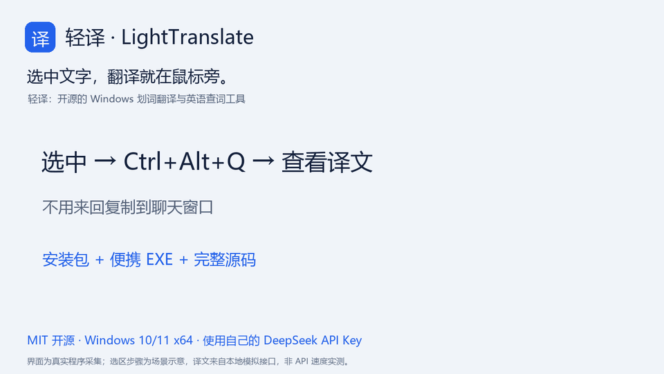
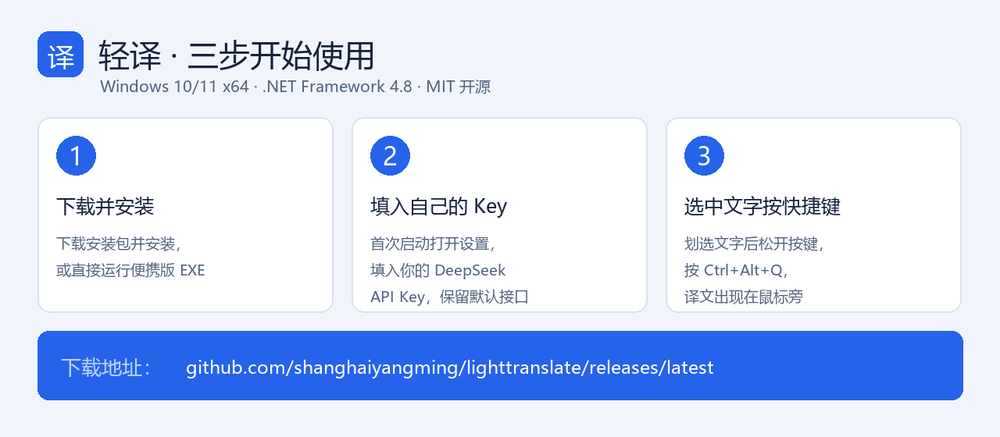

<p align="center"></p>

<h1 align="center">轻译 · LightTranslate</h1>
<p align="center">选中文字，按一下快捷键。翻译就出现在鼠标旁。</p>
<p align="center">
  <a href="https://shanghaiyangming.github.io/lighttranslate/">产品主页与视频</a> ·
  <a href="https://github.com/shanghaiyangming/lighttranslate/releases/latest">下载 Windows 版</a> ·
  <a href="docs/USAGE.md">使用指南</a> ·
  <a href="docs/README.en.md">English</a> ·
  <a href="https://github.com/shanghaiyangming/lighttranslate/issues">反馈问题</a>
</p>


轻译是一款轻量的 Windows 划词翻译与英语查词工具。在浏览器、文档或其他支持复制文字的应用里选中文本，按 **Ctrl+Alt+Q**，即可查看中文译文，无需来回复制到聊天窗口。

**开源软件免费使用；翻译服务使用你自己的 API Key，API 费用由服务商按实际用量收取。**

## 有什么好用的？

- **划词即译**：全局快捷键唤起鼠标旁的小浮窗，点击外部或按 Esc 收起。
- **翻译 + 查词**：长文本默认译成简体中文；英文单词和 1–5 词短语提供 IPA、释义、用法、例句与词源。
- **流式显示**：译文边生成边显示，支持停止、重试、复制和手动粘贴。
- **更易读的结果**：支持常用 Markdown 标题、加粗、列表、引用及代码格式。
- **自己的模型与密钥**：默认使用 DeepSeek，也可设置支持本工具请求参数的 OpenAI 兼容接口。
- **桌面小工具**：托盘常驻，可自定义快捷键，开机启动由用户自行开启。
- **本地加密存储密钥**：使用 Windows DPAPI 当前用户加密，不以明文写入配置或日志。

## 看看怎么用



[观看 / 下载 25 秒 MP4 演示](https://github.com/shanghaiyangming/lighttranslate/releases/download/v1.0.0/LightTranslate-demo-25s.mp4) · [截图与演示说明](docs/DEMO.md)

演示浮窗来自真实程序，阅读选区步骤为场景示意，译文来自本地模拟接口；用于展示交互与排版，不代表真实 API 响应速度。

## 三步开始使用



1. **下载并安装**：[下载安装包](https://github.com/shanghaiyangming/lighttranslate/releases/latest) `LightTranslate-Setup-1.0.0-windows-x64.exe` 双击安装，或直接运行便携版 `LightTranslate.exe`。
2. **填入自己的 Key**：首次启动会打开设置，填入你的 [DeepSeek API Key](https://platform.deepseek.com/api_keys)，保留默认接口 `https://api.deepseek.com` 和模型 `deepseek-flash`，保存即可。
3. **开始翻译**：在任意支持复制的应用中划选文字，按 **Ctrl+Alt+Q**，译文就会出现在鼠标旁。

运行环境：**Windows 10/11，64 位，.NET Framework 4.8**，以及可访问 API 的网络。安装包按当前用户安装，无需管理员权限。API 账号需要有可用额度；ChatGPT/DeepSeek 网页账号与 API 额度并不等同。

> 英语查词内容由模型生成，尤其是音标和词源可能有误。其他接口需支持流式 Chat Completions 及 `thinking.type = disabled`，并非所有标称 OpenAI 兼容的服务都兼容这些参数。

## 隐私与数据流

- 划词时通过模拟复制获取选区，默认尝试恢复原剪贴板；仅在你触发翻译时读取文字。
- 原文和提示词会发送到**你设置的 API 服务商**，API Key 作为认证头随请求发送。默认服务商是 DeepSeek。
- 没有本项目运营的中转服务器，不收集遥测，不保存翻译历史。当前进程内最多缓存 32 个翻译结果，退出后清除。
- 配置位于 `%APPDATA%\LightTranslate\settings.json`，只有加密后的密钥；错误日志只记录异常类型、堆栈与进程事件，保留最近 48 小时。
- 首次运行密钥为空。需要时可在设置中**主动点击**“从 Handy 导入”，复用自己的本机配置。
- GitHub 源码和发布包不附带开发者或用户的配置、密钥、日志与历史数据。

详见 [使用指南](docs/USAGE.md) 和 [安全说明](SECURITY.md)。

## 从源码构建

源码为 C# / Windows Forms，仅依赖 Windows/.NET 系统库，无 NuGet 依赖。

```powershell
git clone https://github.com/shanghaiyangming/lighttranslate.git
cd lighttranslate
powershell -NoProfile -ExecutionPolicy Bypass -File .\build.ps1 -Test
```

生成 `dist\LightTranslate.exe`。`-Test` 运行本地自检和模拟 API 测试，不使用真实 API Key，不产生 API 费用。

安装 [Inno Setup 6/7](https://jrsoftware.org/isinfo.php) 后构建安装包：

```powershell
powershell -NoProfile -ExecutionPolicy Bypass -File .\build.ps1 -Test -Installer
```

可通过 `INNO_SETUP_COMPILER` 指定 `ISCC.exe` 路径。构建脚本兼容 Windows PowerShell 5.1；请保留脚本和安装配置的 UTF-8 BOM。

```text
src/LightTranslate.cs        完整应用源码与本地自检
assets/                     软件图标及可编辑 SVG
build.ps1                   编译与测试入口
installer/LightTranslate.iss Windows 安装包定义
docs/                       使用、英文介绍及分享文案
scripts/audit-secrets.cjs    发布前密钥/隐私文件检查
ci/windows.yml              Windows 自动构建与自检模板
```

`ci/windows.yml` 为 GitHub Actions 配置模板；放入 `.github/workflows/windows.yml` 后可启用自动构建。

## 参与和分享

欢迎 [提出问题或建议](https://github.com/shanghaiyangming/lighttranslate/issues)，也欢迎提交 PR。提交前请运行自检，并避免附上包含密钥或私人原文的配置和日志。详见 [贡献指南](CONTRIBUTING.md)。

如果轻译对你有帮助，欢迎 **Star**、分享项目链接，或使用 [分享文案](docs/SHARING.md) 推荐给朋友。

## 许可

[MIT License](LICENSE) · Copyright © 2026 shanghaiyangming。允许使用、修改、再分发与商用，请保留许可证及版权声明。
