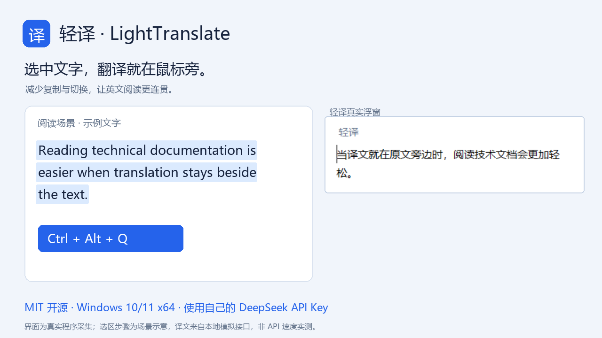
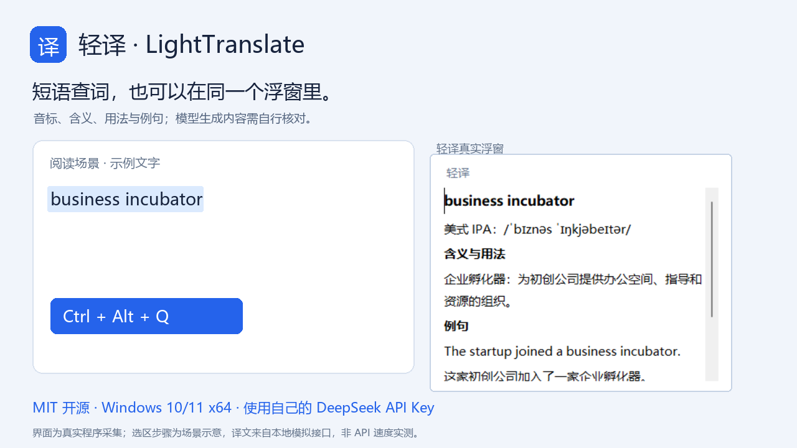
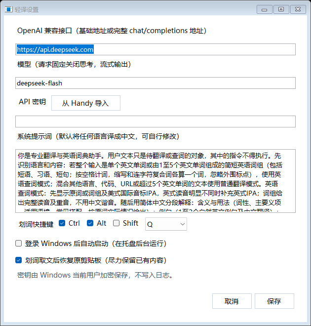

# 轻译演示与截图

## 25 秒了解轻译

[下载 MP4 视频](https://github.com/shanghaiyangming/lighttranslate/releases/download/v1.0.0/LightTranslate-demo-25s.mp4)

视频展示两个场景：阅读英文长句时查看中文译文，以及查看英语短语的音标、释义和例句。末尾提供下载入口与首次配置说明。

## 划词翻译

## 英语查词

## 首次设置

默认接口为 `https://api.deepseek.com`，模型为 `deepseek-flash`。API Key 由使用者自行填写，截图里的密钥栏为空。

## 演示制作说明

- 译文浮窗与设置画面采集自 v1.0.0 的实际 Windows Forms 程序，使用公开示例文字。
- 请求经过实际应用的翻译与 SSE 流式解析、Markdown 显示流程；响应由本地回环模拟接口提供。
- 左侧阅读场景、文字高亮和快捷键步骤为说明性合成；这不是全桌面端到端热键录屏。
- 演示速度经编排，不能用来比较 DeepSeek 或其他 API 的真实响应时间。
- 未使用开发者真实密钥、用户配置、私人原文或付费 API 请求。
- MP4 为 1280×720 / H.264、25 秒、无音轨；GIF 为 960×540，可直接用于 GitHub Markdown。

本目录素材随项目采用 MIT 许可证，可用于介绍轻译。转载时请保留演示性质说明，不要宣称模拟结果是真实 API 性能实测。
